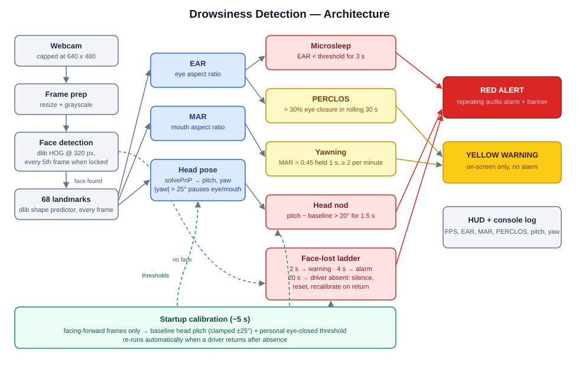

# Drowsiness Detection 😴 🚗

Real-time driver drowsiness detection from a webcam, using OpenCV and dlib's
68-point facial landmarks. It combines four fatigue signals rather than a
single eyes-closed check:

| Signal | How it's measured | Response |
|---|---|---|
| **Microsleep** | Eye Aspect Ratio (EAR) below threshold for 3 s | 🔴 Alert + alarm |
| **PERCLOS** | % of eye closure over a rolling 30 s window (standard fatigue metric) | 🟡 Warning |
| **Yawning** | Mouth Aspect Ratio (MAR) spikes, ≥2 yawns within a minute | 🟡 Warning |
| **Head nodding** | Head pitch from solvePnP pose estimation; face lost from view | 🔴 Alert / 🟡 Warning |

Red alerts sound a repeating audio alarm (Windows `winsound`; terminal bell
elsewhere).

## Setup

```
pip install -r requirements.txt
```

The dlib 68-landmark model is included in `models/`.

## Run

```
python Drowsiness_Detection.py
```

On startup it spends 5 seconds **calibrating** — look ahead normally so it
can learn your usual head angle and eye openness. Press `q` in the video
window to quit. Useful flags:

```
--headless              no video window (for screen-less devices; Ctrl+C stops)
--camera 1              use a different webcam
--no-sound              disable the audio alarm
--calibrate-secs 5      startup calibration length (0 disables)
--closed-secs 3.0       seconds of closed eyes before microsleep alert
--yawn-thresh 0.45      mouth-open threshold for yawns
--pitch-thresh 20       downward head angle (degrees) that counts as nodding
--yaw-limit 25          head turn beyond which eye checks pause (mirror checks)
```

Run `python Drowsiness_Detection.py --help` for the full list.

## Testing with a phone

Both directions work over your Wi-Fi (phone and PC on the same network):

**Phone as the camera** — install a camera-streaming app (e.g. *IP Webcam*
on Android), start its server, and point the detector at the stream URL the
app shows:

```
python Drowsiness_Detection.py --camera http://192.168.1.42:8080/video
```

This is a realistic dry run for in-car mounting: prop the phone where a
dashboard camera would sit.

**Phone as the screen** — stream the annotated video (alerts, HUD) to a
browser:

```
python Drowsiness_Detection.py --serve
```

The console prints a `http://<pc-ip>:8000` address — open it on the phone.
Note that a phone cannot use `localhost` (that means the phone itself);
always use the printed PC address. If Windows Firewall asks, allow Python
on private networks. The audio alarm still plays from the PC.

## Designed for in-car use

- **Calibration** makes the pitch baseline relative to the camera's mounting
  angle, so a dashboard camera looking up at the driver works the same as a
  laptop webcam.
- **Look-away tolerance**: mirror and shoulder checks (large head yaw) pause
  the eye/mouth measurements instead of accumulating toward a false alarm.
- **Headless mode** runs without any display, ready for a small in-car
  computer that boots straight into detection.
- **Driver absence vs. slumped driver**: losing the face briefly escalates
  warning → alarm (a dropped head leaves the camera's view). While the face
  is lost, an upper-body detector checks whether someone is still in the
  seat — if a body is visible the alarm keeps sounding indefinitely
  ("DRIVER NOT RESPONDING"). Only when neither face nor body is seen for
  ~20 s does it assume the driver left: the alarm silences, fatigue history
  resets, and it recalibrates automatically when someone sits back down.
- A regular webcam only works in daylight; night use needs an infrared
  camera (a plug-in USB IR webcam works).

## Low-spec devices

Face detection dominates the frame cost, so it runs on a downscaled frame
and, once a face is locked, only every 5th frame — landmarks (which are
~30x cheaper) still run every frame, so alert timing is unaffected. This
cuts per-frame CPU work by roughly 10x versus naive per-frame detection.
On very weak hardware you can push further:

```
--detect-every 10       re-detect the face less often
--detect-width 240      detect on an even smaller frame (don't go below ~240)
```

The bottom-left HUD shows live FPS. Alert thresholds are measured in
seconds, not frames, so behavior stays consistent at any frame rate.

## Architecture



## How it works

Each eye is described by 6 landmark points; the EAR is the ratio of the
vertical eye openings to the horizontal width — it collapses toward 0 when
the eye closes. The MAR does the same for the inner lips. Head pose is
recovered by fitting six landmarks (nose, chin, eye and mouth corners) to a
3D face model with `cv2.solvePnP`; pitch (relative to the calibrated
baseline) indicates a drooping head and yaw indicates looking away. Live
values for all metrics are shown in the bottom-left HUD.

## License

MIT — see [LICENSE.txt](LICENSE.txt).
